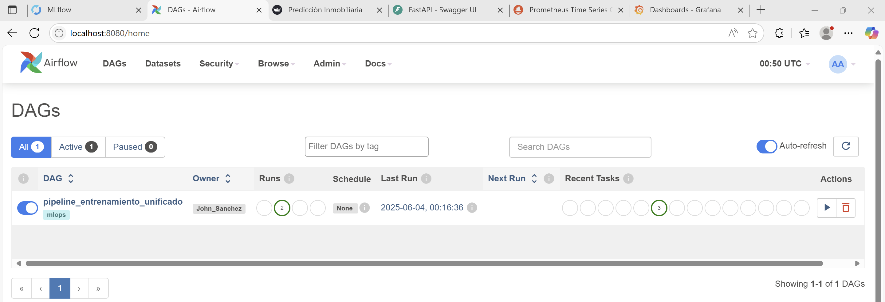
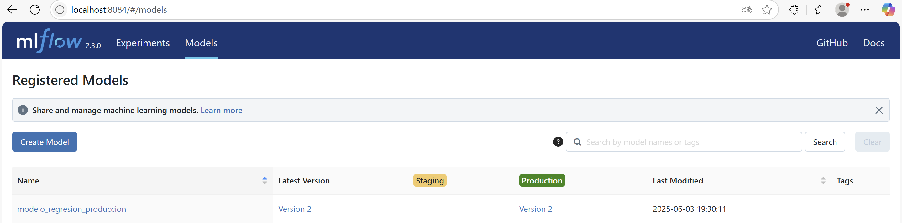
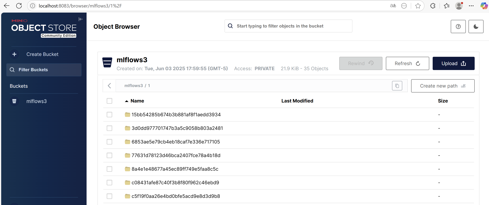
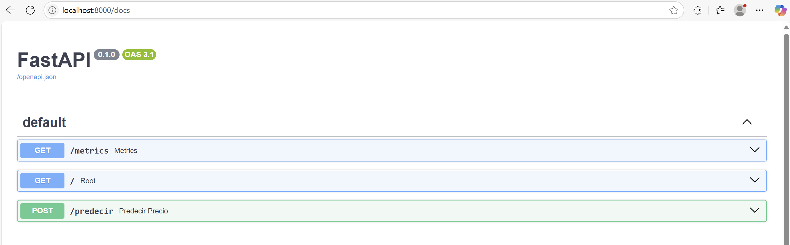
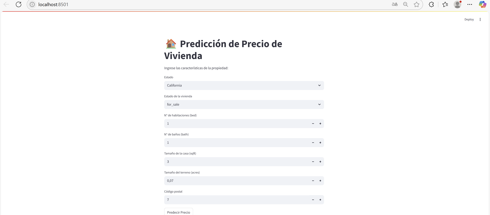

# 📌 Proyecto Final MLOps - Entrenamiento y Monitoreo de Modelos

Este proyecto implementa un pipeline completo de MLOps para un sistema de predicción inmobiliaria. Incluye desde el entrenamiento, versionamiento y despliegue de modelos ML, hasta la interfaz para consumo de predicciones y monitoreo de métricas.

---

## 📦 Arquitectura del Proyecto

El proyecto está compuesto por varios servicios orquestados con Docker Compose que interactúan en una red llamada mlops_net:

    - MySQL: Base de datos para almacenar el backend de MLflow.
    - MinIO: Servicio de almacenamiento compatible con S3 para guardar artefactos (modelos, datasets, etc.).
    - MLflow: Servidor de tracking y model registry para gestión de modelos.
    - FastAPI: API backend que expone endpoints para realizar predicciones usando modelos versionados en MLflow.
    - Streamlit: Interfaz web frontend para interacción y visualización de resultados.
    - Prometheus & Grafana: Herramientas para monitoreo y visualización de métricas del sistema.

```
PROYECTO_FINAL/
├── app_back/
│   ├── dockerfile_api
│   ├── main.py
│   └── requirements_api.txt
├── app_front/                              # Frontend con Streamlit
│   ├── app.py
│   ├── dockerfile_stream
│   └── requirements_app.txt
├── connections/                            # Conexiones a bases de datos
│   ├── __init__.py
│   └── connections.py
├── dags/                                   # DAGs de Airflow (pipeline unificado)
│   └── pipeline.py
├── grafana/                                # Dashboards y configuración    
│   └── provisioning/
│       ├── dashboards/
│       │   └── fastapi_dashboard.json
│       ├── datasources/
│       └── dashboards.yml
├── imagenes/
├── logs/                                   # Logs de Airflow
├── minio/                                  # Almacenamiento S3 
├── mlflow/                                 # Configuración de MLflow
│   ├── dockerfile_mlflow
│   ├── init.sql
│   └── requirements_mlflow.txt
├── models/                                # Modelos y artefactos generados
│   ├── columnas_entrenamiento.json
│   └── modelo_mejor.pkl
├── prometheus/                           # Configuración de Prometheus
│   └── prometheus.yml
├── docker-composeairflow.yml             # Servicios Airflow
├── docker-composemlflow.yml              # Servicio MLflow, MiniO y SQL
├── docker-compose.yml                    # Base:  Streamlit, FastApi, Prometheus y grafana
├── dockerfile
└── requirements.txt
```
---

## 🚀 Servicios principales

| Servicio     | Puerto | Descripción |
|--------------|--------|-------------|
| **Airflow**  | `8080` | Orquestación del pipeline de datos |
| **MLflow**   | `8084` | Registro de experimentos y modelos |
| **MinIO**    | `8083` | Almacenamiento tipo S3 para artefactos |
| **Streamlit**| `8501` | Visualización de resultados |
| **FastAPI**  | `8000` | Backend API |
| **Grafana**  | `3000` | Visualización de métricas |
| **Prometheus** | `9090` | Recolección de métricas |
| **MySQL**    | `3306` | Base de datos principal |

---

## 🧪 Flujo del pipeline

1. **Extracción de datos desde API externa**
2. **Almacenamiento en MySQL (RAW)**
3. **Preprocesamiento, limpieza y división (CLEAN)**
4. **Entrenamiento con `LinearRegression`**
5. **Registro de métricas y modelos en MLflow**
6. **Selección y guardado del mejor modelo**
7. **Monitoreo de la API con Prometheus + Grafana**

---

## ⚙️ Cómo ejecutar el proyecto

### 1. Crear red Docker externa

```bash
docker network create mlops_net
```

### 2. Levantar todos los servicios

```bash
docker compose -f docker-compose.yml \
               -f docker-composemlflow.yml \
               -f docker-composeairflow.yml up -d --build
```

### 3. Acceder a las interfaces

- Airflow: [http://localhost:8080](http://localhost:8080)



- MLflow: [http://localhost:8084](http://localhost:8084)


- MinIO: [http://localhost:8083](http://localhost:8083)



- FastApi: [http://localhost:8000](http://localhost:8000/docs)



- Streamlit: [http://localhost:8501](http://localhost:8501)


- Grafana: [http://localhost:3000](http://localhost:3000)


- Prometheus: [http://localhost:9090](http://localhost:9090)


> Usuario y contraseña por defecto de Grafana: `admin / admin`
> Usuario y contraseña por defecto de MiniO `admin / supersecret`
> Usuario y contraseña por defecto de Airflow `airflow / airflow`

---

## 📁 DAG principal (`pipeline.py`)

Se ejecuta secuencialmente en Airflow:

- `fase_1_extraccion`: consumo condicional de nuevos batches
- `fase_2_limpieza_y_division`: preprocesamiento y partición en train/val/test
- `fase_3_entrenamiento_modelo`: entrenamiento y registro en MLflow + MinIO


---

## 📌 Notas adicionales

- Los modelos son almacenados localmente y en MLflow (vía MinIO).
- Las métricas se registran también en base de datos para análisis posterior y se guarda el modelo en con la etiqueta de produccion
- El sistema puede ser extendido con alertas y despliegue de modelos vía API.

## 📁  Despliegue total con Kubertnets

