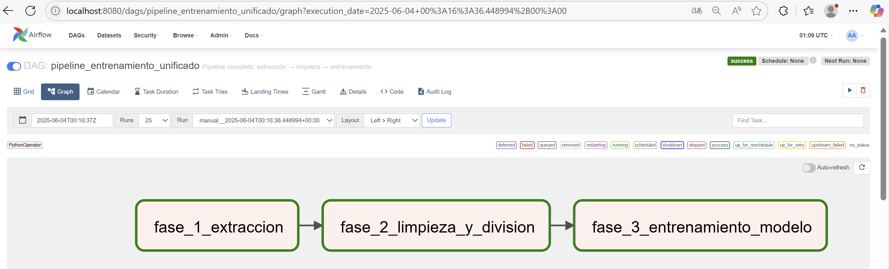
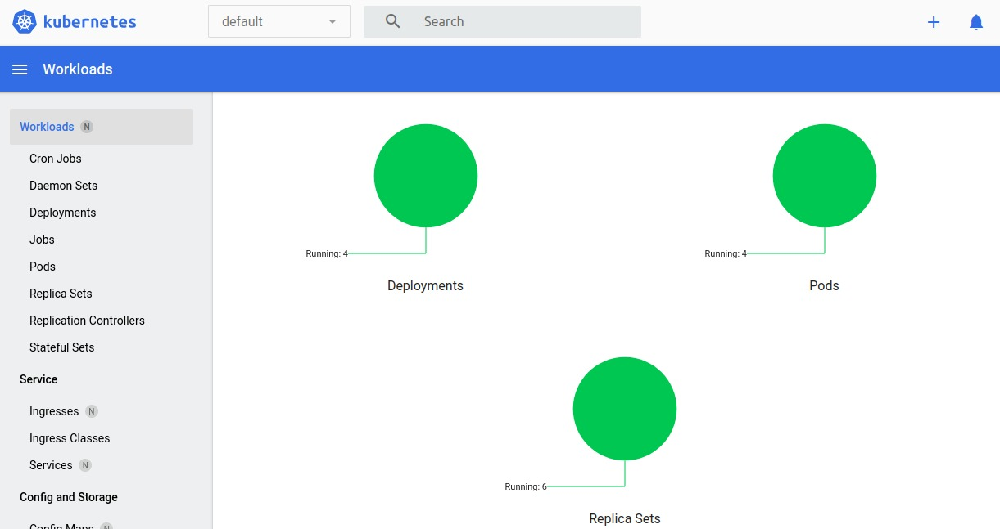
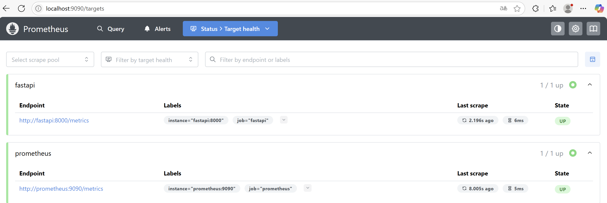
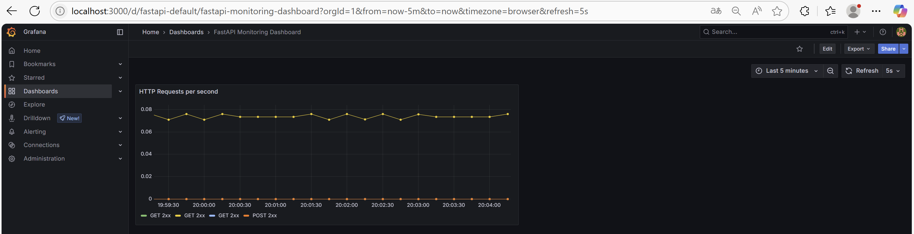
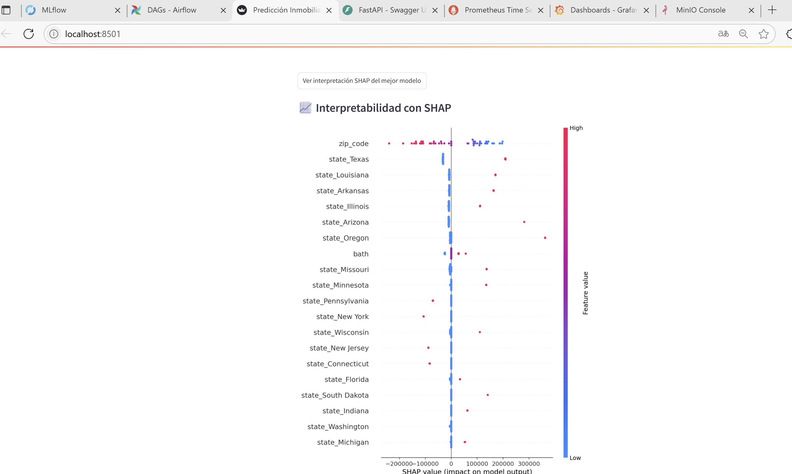

---

# 📌 Proyecto Final MLOps - Entrenamiento y Monitoreo de Modelos

Este proyecto implementa un pipeline completo de **MLOps** para un sistema de predicción inmobiliaria. Incluye desde el entrenamiento, versionamiento y despliegue de modelos ML, hasta la interfaz para consumo de predicciones y monitoreo de métricas en producción.

---

## ⚙️ Arquitectura del Proyecto

El ecosistema está compuesto por múltiples servicios desplegados sobre **Kubernetes**, excepto **Airflow**, que corre localmente con **Docker Compose** para orquestar el pipeline de datos. A continuación se presenta el diseño general del clúster:


### 🔌 Despliegue por IP y puerto

| IP              | Servicio  | Puerto            | Descripción                                      |
| --------------- | --------- | ----------------- | ------------------------------------------------ |
| `10.43.101.200` | MySQL     | `31036`           | Base de datos                                    |
|                 | MLflow    | `31500`           | Registro de experimentos                         |
|                 | MinIO     | `31900` / `31901` | Backend / Frontend de almacenamiento             |
| `10.43.101.179` | FastAPI   | `31800`           | API REST                                         |
|                 | Streamlit | `31851`           | Frontend de usuario                              |
|                 | Grafana   | `31300`           | Visualización de métricas                        |
| `10.43.101.190` | Airflow   | `8080`            | Orquestación del pipeline *(vía Docker Compose)* |

---

## 📦 Componentes

* **MySQL:** Almacena datos y metadatos de MLflow.
* **MinIO:** Sistema de almacenamiento S3-compatible para guardar modelos y datasets.
* **MLflow:** Seguimiento de experimentos y modelos.
* **FastAPI:** Exposición del modelo en producción a través de endpoints REST.
* **Streamlit:** Interfaz gráfica para realizar predicciones.
* **Prometheus + Grafana:** Monitorización del sistema y visualización de métricas clave.
* **Airflow:** Orquestador de tareas, ejecutado localmente.

---

## 🧱 Estructura del Proyecto

```
PROYECTO_FINAL/
├── app_back/              → Backend FastAPI
├── app_front/             → Frontend Streamlit
├── connections/           → Conexiones a MySQL
├── dags/                  → DAGs de Airflow (pipeline.py)
├── grafana/               → Dashboards de monitoreo
├── imagenes/              → Recursos gráficos y diseño del sistema
├── logs/                  → Logs de Airflow
├── minio/                 → Datos de almacenamiento
├── mlflow/                → Configuración del servidor MLflow
├── models/                → Modelos entrenados y columnas
├── prometheus/            → Configuración de monitoreo
├── docker-compose*.yml    → Archivos para Airflow y servicios auxiliares
├── dockerfile*            → Dockerfiles por servicio
└── requirements.txt       → Dependencias generales
```

---

## 🔄 Flujo del Pipeline

1. **Extracción** de datos desde una API externa.
2. **Almacenamiento** inicial en MySQL (`RAW`).
3. **Limpieza y partición** (`CLEAN`) en sets de entrenamiento/validación/test.
4. **Entrenamiento** del modelo (`LinearRegression`).
5. **Registro** en MLflow y almacenamiento del modelo en MinIO.
6. **Selección** y etiquetado como "Producción" del mejor modelo.
7. **Despliegue y predicción** vía FastAPI.
8. **Monitoreo** del API con Prometheus y Grafana.

---

## 🚀 Ejecución del Proyecto

### 1. Crear red externa (solo para Airflow)

```bash
docker network create mlops_net
```

### 2. Levantar servicios Airflow localmente

```bash
docker compose -f docker-composeairflow.yml up -d --build
```

### 3. Desplegar el resto en Kubernetes

Asegúrate de tener un clúster activo y aplica los manifiestos correspondientes:

```bash
kubectl apply -f k8s/
```

> **Nota:** los manifiestos Kubernetes deben definir los servicios con sus respectivos NodePorts según el diseño del clúster.

---

## 🌐 Acceso a interfaces

* **Airflow:** [http://10.43.101.190:8080](http://10.43.101.190:8080)
* **MLflow:** [http://10.43.101.200:31500](http://10.43.101.200:31500)
* **MinIO Front:** [http://10.43.101.200:31901](http://10.43.101.200:31901)
* **FastAPI (Swagger):** [http://10.43.101.179:31800/docs](http://10.43.101.179:31800/docs)
* **Streamlit:** [http://10.43.101.179:31851](http://10.43.101.179:31851)
* **Grafana:** [http://10.43.101.179:31300](http://10.43.101.179:31300)
* **Prometheus:** [http://10.43.101.179:31800](http://10.43.101.179:31800)

---

## 🗂️ DAG principal (`pipeline.py`)

El archivo orquesta las siguientes tareas:

* `fase_1_extraccion` → Obtención de nuevos lotes
* `fase_2_limpieza_y_division` → Preprocesamiento
* `fase_3_entrenamiento_modelo` → Registro y evaluación



---

## Dashboard Kubernets


---
## 📈 Monitoreo

* **Prometheus:** expone métricas del API FastAPI.
* **Grafana:** dashboard listo para observación del rendimiento y alertas.




---

## Interpretabilidad



## 👥 Autores

* [John Sanchez](https://github.com/JohnSanchez27)
* [Santiago González Meneses](https://github.com/santigonzalez13)
* Hugo Poveda Girata hpoveda

---
